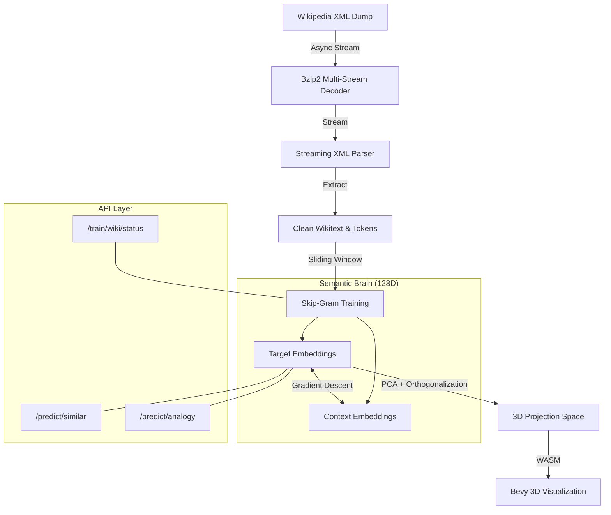

# Vecors: High-Performance 3D Semantic Engine

Vecors is a self-learning semantic engine that builds a high-dimensional vector space from scratch, trained on the entirety of English Wikipedia. It projects complex word relationships into a navigable 3D visualization using advanced linear algebra and neural embedding techniques—all implemented without external machine learning frameworks.

## The Pipeline Architecture



---

## Technical Deep Dive

### 1. Neural Embedding Model (Skip-Gram + Negative Sampling)
The core of Vecors is a **128-dimensional embedding space**. Unlike simple hashing, this model learns semantic proximity:
*   **Skip-Gram**: Predicts context words from a target center word.
*   **Negative Sampling (SGNS)**: Actively pushes unrelated words apart in the 128D space using a Sigmoid objective function.
*   **Antonym Repulsion**: A custom enhancement that applies 2.5x repulsion strength to words explicitly listed as antonyms in the dictionary dataset.
*   **Dot Product Prediction**: Word relationships are preserved as vector offsets. The dot product between two offsets (e.g., King-Man and Queen-Woman) represents the similarity of their semantic relationships.
*   **Subsampling**: Frequent words (like "THE", "AND") are probabilistically skipped (80% skip rate) to focus the gradient on meaningful semantic signals.

### 2. High-Precision Linear Algebra
To maintain stability across a vocabulary of 330,000+ words:
*   **Double Precision Summation**: Dot products and length calculations use `f64` internal accumulation to prevent rounding drift in high-dimensional space.
*   **Box-Muller Initialization**: New words are initialized using a Gaussian distribution, ensuring an even spread across the 128D hypersphere from the start.
*   **Adaptive Learning Rate**: The learning rate ($\alpha$) decays linearly as training progresses through the Wikipedia dump:
    $$\alpha = \text{max}(0.0001, \alpha_{0} \times (1 - \frac{\text{tokens}}{\text{TotalTokens}}))$$

### 3. 3D Projection Pipeline
Projecting 128D down to 3D for visualization requires preserving local structure:
*   **PCA (Principal Component Analysis)**: Finds the axes of maximum variance.
*   **Gram-Schmidt Orthogonalization**: Ensures the 3D axes are perfectly perpendicular, preventing the 3D space from collapsing into 1D or 2D.
*   **Semantic Whitening**: Scales the projected dimensions by their standard deviation to ensure the 3D space is perfectly balanced across all quadrants.

---

## Getting Started

### 1. Requirements
*   Rust (Latest Stable)
*   WASM Target: `rustup target add wasm32-unknown-unknown`
*   Python (for serving the UI)

### 2. Running the Wiki Trainer
The trainer streams Wikipedia on-the-fly without saving the 24GB dump to disk.
```powershell
# Start the API and Trainer server
cargo run --release --bin trainer
```

### 3. Controlling Training
Once the server is running on `http://localhost:3000`:
*   **Start Training**: 
    `Invoke-WebRequest -Method Post -Uri "http://localhost:3000/train/wiki/start"`
*   **Check Progress**: 
    `Invoke-RestMethod -Uri "http://localhost:3000/train/wiki/status"`
*   **Sanitize & Balance**: 
    `Invoke-WebRequest -Method Post -Uri "http://localhost:3000/train/wiki/sanitize"` (Recommended after large training runs to center the space).

### 4. Building the 3D Frontend
```powershell
.\build.bat
python -m http.server 8000
```
Navigate to `http://localhost:8000`.

---

## API Documentation

### `GET /predict/similar?word=KING&n=10`
Returns the top N semantically closest words using Cosine Similarity.
```json
{
  "word": "KING",
  "similar": [["QUEEN", 0.89], ["PRINCE", 0.82], ...]
}
```

### `GET /predict/analogy?a=KING&b=MAN&c=WOMAN`
Solves semantic analogies: **B is to A as C is to X**.
*Calculates: $Vector(X) = Vector(B) - Vector(A) + Vector(C)$*

### `GET /predict/relationship?a1=KING&b1=MAN&a2=QUEEN&b2=WOMAN`
Compares two semantic relationships using dot product similarity of their vector offsets.
*Calculates: $(Vector(b1) - Vector(a1)) \cdot (Vector(b2) - Vector(a2))$*

### `POST /predict/attention`
Calculates Softmax attention weights across a list of context words relative to a target word.

---

## Project Structure
*   `src/brain/model.rs`: The 128D Semantic Brain & SGNS implementation.
*   `src/brain/linalg.rs`: Custom linear algebra (Vectors, Dot products, Normalization).
*   `src/train/wiki.rs`: Streaming Wikipedia bzip2 decoder and XML parser.
*   `src/trainer.rs`: Axum API server for model management.
*   `src/lib.rs`: Bevy 3D application logic.
